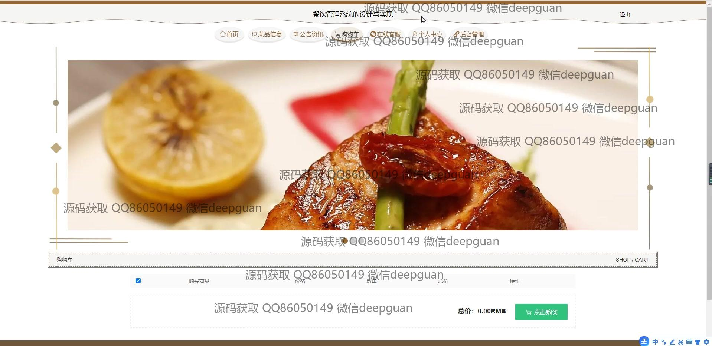

<h1 align="center">餐饮管理系统的设计与实现</h1>

## 简介
餐饮管理系统：角色分为管理员、用户；功能包括用户管理、菜品信息管理、订单处理、库存管理、报表生成等。帮助优化餐饮业务运营和数据分析。    --计算机毕业设计源码；毕设源码；java毕业设计源码

## 联系方式

<h3 align="center">获取完整代码与数据库文件 + 微信：deepguan QQ: 86050149 QQ群: 783742310</h3>

<h3 align="center">可帮忙远程部署 包运行成功！提供远程部署、修改代码、设计文档指导、代码讲解等服务！</h3>

## 功能介绍（完整见运行截图）
管理员：登录、注册、退出，管理网站首页的轮播图、公告资讯，管理用户信息、菜品分类、菜品信息和订单。支持添加、编辑、删除菜品，管理库存，生成销售报表，分析经营数据，优化决策，提高业务效率。

用户：登录、注册、退出，浏览首页导航栏、轮播图和公告资讯，查看菜品列表及详情，添加购物车、选择收货地址、确认订单并下单。支持查看个人中心，管理个人信息、收货地址、订单记录和收藏内容。

访客：无需登录即可浏览首页、菜品信息、公告资讯和自然风光展示，查看推荐菜品，了解菜品详情。注册后可解锁购物车、订单管理等功能，提升交互体验。

客服：通过在线客服模块提供实时支持，解答用户疑问，协助订单查询、地址修改及其他操作，增强用户体验，提升系统服务质量。

## 运行截图

本代码来源于网络,仅供学习参考使用!

